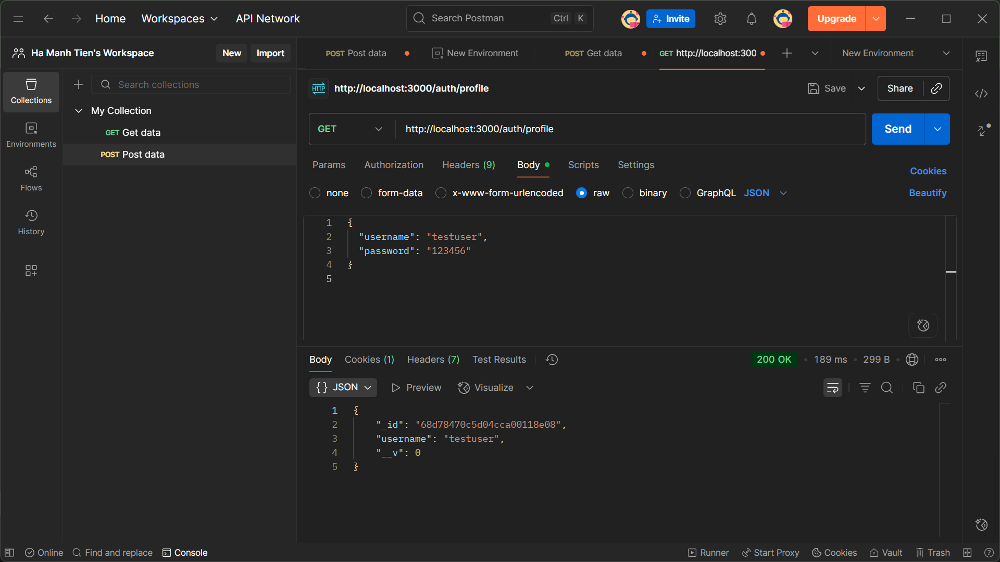
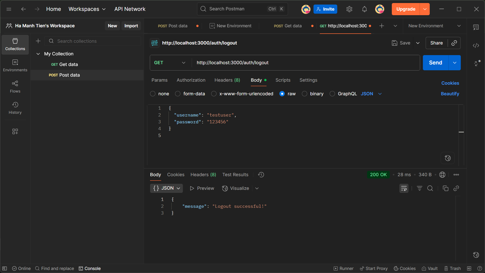

# Project: Cookie Session Authentication

## Mô tả
Dự án này minh họa cơ chế đăng nhập, đăng ký, quản lý profile và đăng xuất sử dụng cookie & session authentication trong Node.js.

## Hình minh họa

### 1. Giao diện đăng nhập (Login)

### 2. Giao diện đăng ký (Register)

### 3. Giao diện hồ sơ người dùng (Profile)

### 4. Giao diện đăng xuất (Logout)

## Cấu trúc thư mục

